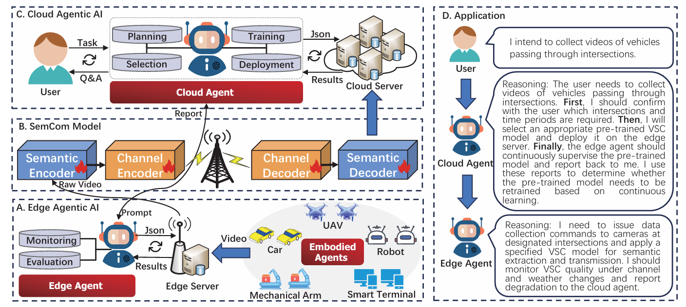
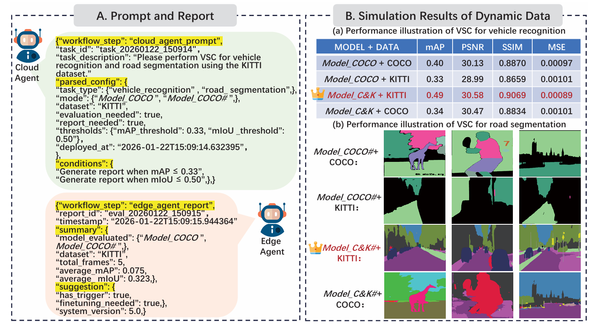
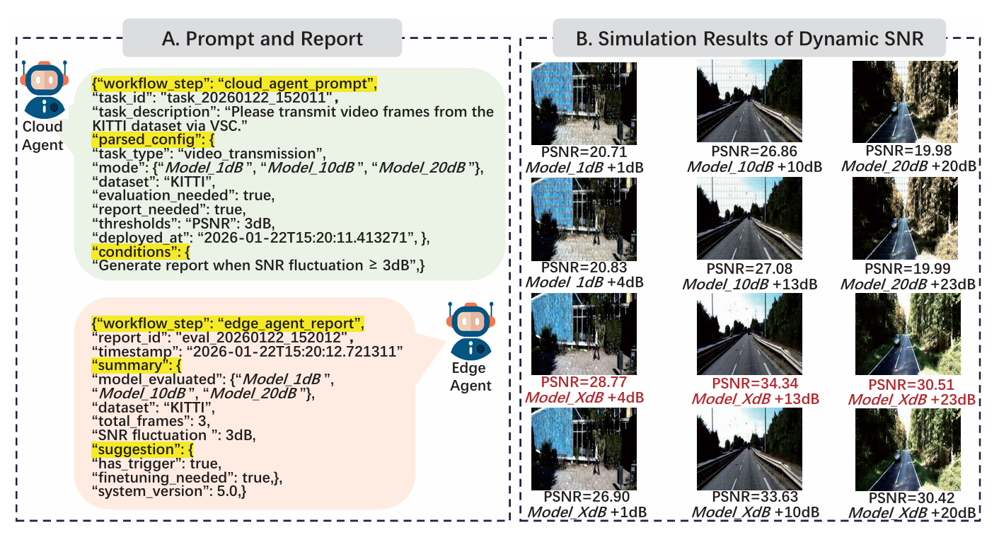

# self_evolving_vsc

This repository provides the reference implementation and experimental materials for the paper:

**Self-Evolving Video Semantic Communication With Agentic AI: Architecture, Applications and Challenges**

## Introduction

Video Semantic Communication (VSC) enables task-oriented video transmission by conveying semantic representations instead of raw bit streams. However, existing VSC systems are mostly static and struggle with long-term non-stationary environments, such as evolving video content distributions, time-varying wireless channels, and changing semantic objectives.

This work proposes an **agentic AI–empowered self-evolving VSC architecture**, which integrates **continual learning** into a **cloud–edge–device closed-loop framework**. By coordinating embodied, edge, and cloud agents, the system supports adaptive model deployment, online performance monitoring, and feedback-driven semantic model evolution.

## Framework Overview

The proposed architecture consists of three types of agents:

- **Embodied Agents**: deployed on devices (e.g., UAVs, vehicles) for perception and data acquisition control  
- **Edge Agents**: deployed on edge servers to execute VSC models and monitor task and channel performance  
- **Cloud Agents**: responsible for task interpretation, model selection, deployment, and continual learning decisions  

Together, these agents enable long-term self-evolution of VSC systems.

  

## Key Features

- Agentic AI–driven cloud–edge–device collaboration  
- Continual learning–based semantic model evolution  
- Robust adaptation to data distribution shifts  
- Robust adaptation to dynamic channel conditions  
- Mitigation of catastrophic forgetting  

## Dataset

The following datasets are used in our experiments:

**COCO**: used for pre-training semantic communication models  
**KITTI**: used to simulate data distribution shifts and autonomous driving scenarios  

Please replace dataset paths with your local directories before running the code.

## Requirement

Some key requirements are listed below. More details can be found in `requirements.txt`.

- Python ≥ 3.9  
- Torch ≥ 2.0.0  
- NumPy ≥ 1.12.1  
- SciPy == 1.10.0
- Opencv-Python ≥ 4.5.0
- Ultralytics ≥ 8.0.0
- Zhipuai ≥ 2.0.0
- GPU memory ≥ 8 GB  

## Evaluation

### Data Distribution Shift

When pre-trained models are applied to new data distributions, edge agents continuously monitor task performance (e.g., mAP, mIoU). Once performance degradation exceeds predefined thresholds, the cloud agent autonomously triggers continual learning (e.g., EWC-based methods) to evolve the VSC models.

  

### Dynamic Channel Conditions

To handle time-varying wireless channels, multiple Deep JSCC models trained at different SNRs are deployed. When significant SNR changes are detected, the cloud agent initiates architecture evolution–based continual learning, such as gating mechanisms with shared decoders.

  

## welcome to cite our work
